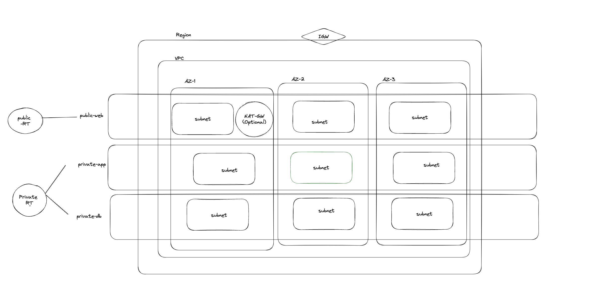
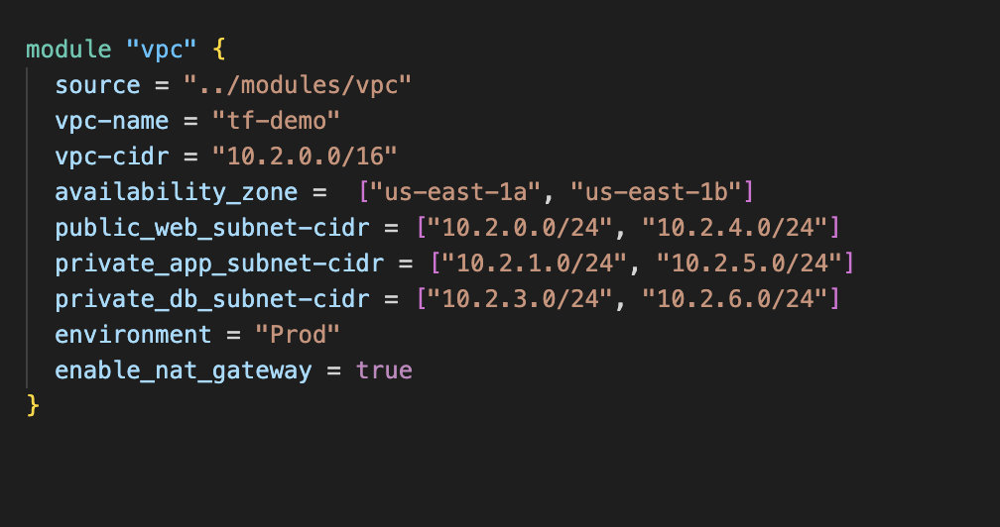
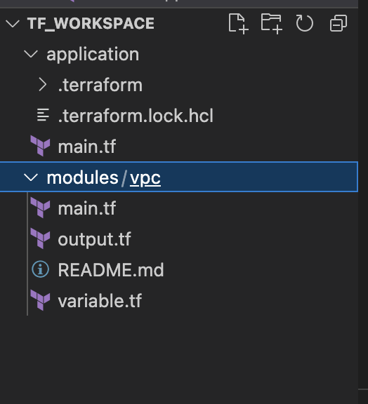
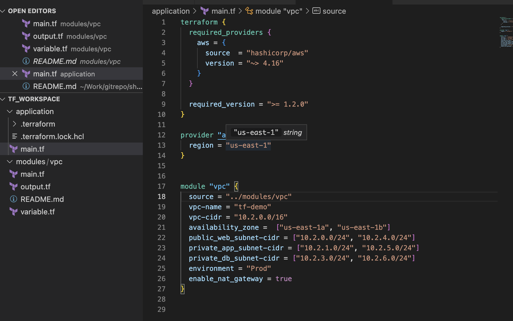
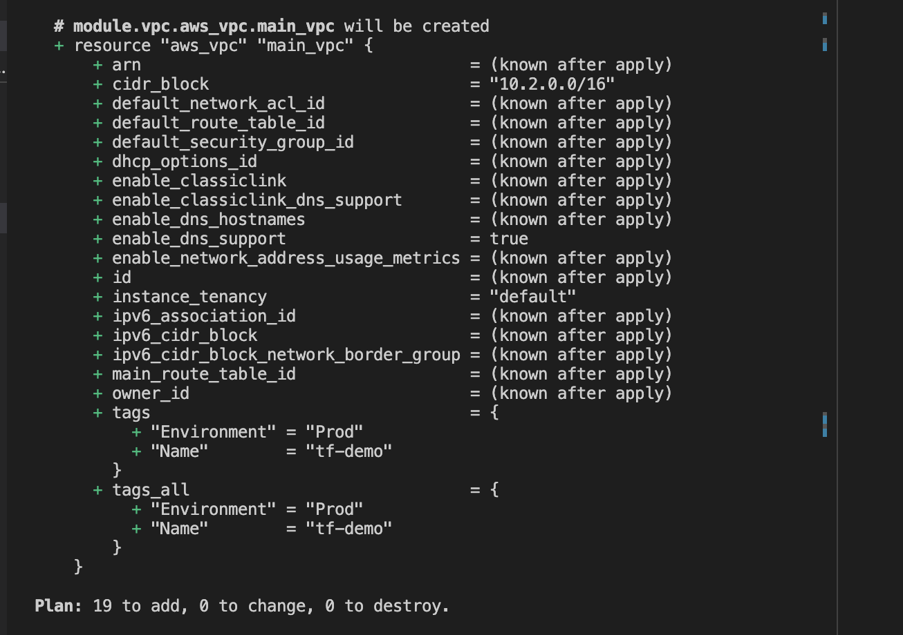
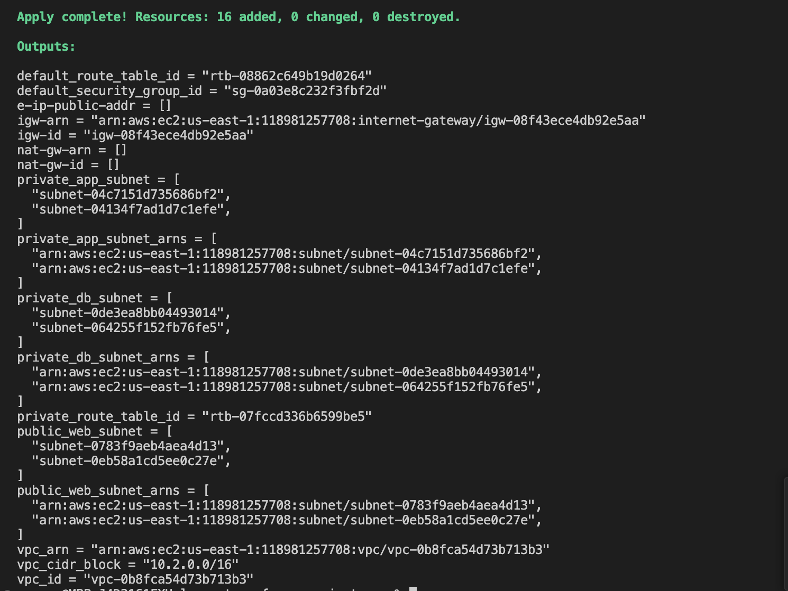

## AWS VPC Module
This terraform module creates VPC resources in AWS

------------------------------------------------------------

## Architecture Diagram

---------------------------------------------
## Usage
These are the variables we need to configured in our variable.tf 

## Folder Structure

------------------------------------------------------------

## OUTPUT SCREENSHOT

Calling the Module:

Resources Created:

Output.tf Values

